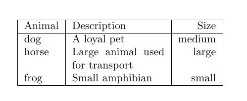
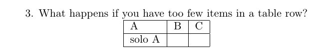
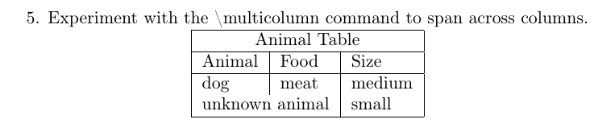

---
## Front matter
lang: ru-RU
title: Презентация по лабораторной работе №5
subtitle: Дисциплина "Computer Skills for Scientific Writing"
author: Леон А Х Ф
institute: 
  - Кафедра теории вероятностей и кибербезопасности, Российский университет дружбы народов имени Патриса Лумумбы, Москва, Россия
date: 26 октября, 2024, Москва, Россия

## i18n babel
babel-lang: russian
babel-otherlangs: english

## Formatting pdf
toc: false
toc-title: Содержание
slide_level: 2
aspectratio: 169
section-titles: true
theme: metropolis
header-includes:
 - \metroset{progressbar=frametitle,sectionpage=progressbar,numbering=fraction}

---

# Информация

## Докладчик

:::::::::::::: {.columns align=center}
::: {.column width="70%"}

  * Леон Атупанья Хосе Фернандо
  * студент кафедры теории вероятностей и кибербезопасности
  * Российский университет дружбы народов имени Патриса Лумумбы
  * НФИмд-01-24, 1032249918
  * <https://github.com/>

:::
::: {.column width="30%"}


:::
::::::::::::::

# Вводная часть

## Актуальность

Создание и форматирование таблиц в LaTeX является важным навыком для оформления научных работ, где структурированное представление данных обеспечивает точность и читаемость публикаций.

## Объект и предмет исследования

- Окружение `tabular` в LaTeX
- Типы выравнивания колонок: `l`, `c`, `r`, `p{width}`
- Команда `\multicolumn` для объединения ячеек

## Цели и задачи

Освоить основные принципы создания и форматирования таблиц в LaTeX, изучить различные типы выравнивания колонок, методы объединения ячеек и профессиональное оформление таблиц для научных работ.

## Материалы и методы

- Дистрибутив TeX Live
- Окружение `tabular`
- Команды `\hline`, `\multicolumn`

# Результаты

## Базовое создание таблиц
```latex
\begin{tabular}{|l|p{3cm}|r|}
    \hline
    Animal & Description & Size \\
    \hline
    dog & A loyal pet & medium \\
    horse & Large animal used for transport & large \\
    frog & Small amphibian & small \\
    \hline
\end{tabular}
```

## Результат базовой таблицы

{#fig:001 width=90%}

## Эксперименты с выравниванием колонок
```latex
\begin{tabular}{|l|c|r|}
    \hline
    Left (l) & Center (c) & Right (r) \\
    \hline
    dog & meat & 123 \\
    elephant & grass & 45.6 \\
    cat & fish & 7 \\
    \hline
\end{tabular}
```

## Результат выравнивания колонок

{#fig:002 width=90%}

## Анализ обработки ошибок: недостаток элементов
```latex
\begin{tabular}{|l|l|l|}
    \hline
    A & B & C \\
    \hline
    solo A &  &  \\
    \hline
\end{tabular}
```

## Результат при недостатке элементов

{#fig:003 width=90%}

## Объединение ячеек с помощью \multicolumn
```latex
\begin{tabular}{|l|l|l|}
    \hline
    \multicolumn{3}{|c|}{Animal Table} \\
    \hline
    Animal & Food & Size \\
    \hline
    dog & meat & medium \\
    \multicolumn{2}{|l|}{unknown animal} & small \\
    \hline
\end{tabular}
```

## Результат объединения ячеек

{#fig:004 width=90%}

# Выводы

## Освоенные технологии и умения

- Создание базовых и сложных табличных структур в LaTeX
- Применение различных типов выравнивания колонок (`l`, `c`, `r`, `p{width}`)
- Анализ поведения системы при ошибках в таблицах
- Объединение ячеек с помощью `\multicolumn`
- Профессиональное оформление таблиц для научных публикаций
