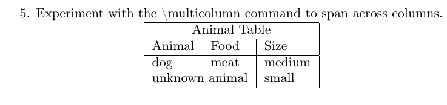

# Лабораторнаяработа No 5

**Computer Skills for Scientific Writing**

## Хосе Фернандо Леон Атупанья | НФИмд-01-24

## Содержание

- 1 Цель работы
- 2 Выполнение лабораторной работы
- 3 Выводы

## 1 Цель работы
Изучить структуру и правильный способ создания таблиц в LaTeX, освоить различные типы выравнивания, объединения ячеек и форматирования таблиц для научных работ.

## 2 Выполнение лабораторной работы

1. Использование простого примера таблицы для начала экспериментов
В этом упражнении мы создали базовую таблицу с тремя колонками, используя различные типы выравнивания: левое, абзацное и правое.

Базовая таблица с разными типами колонок

Таблица с вертикальными и горизонтальными линиями

2. Испытание различных выравниваний с использованием типов колонок l, c и r.

Мы экспериментировали с различными комбинациями выравнивания: левое (l), центральное (c) и правое (r).

Таблица с выравниванием l-c-r

Различные типы данных в разных выравниваниях

3. Что происходит, если в строке таблицы слишком мало элементов?
При наличии недостаточного количества элементов в строке таблицы LaTeX оставляет пустые ячейки для отсутствующих элементов.

Таблица с недостающими элементами

Результат - пустые ячейки

4. Что происходит, если в строке таблицы слишком много элементов?
При наличии избыточного количества элементов LaTeX выдает ошибку компиляции "Extra alignment tab has been changed to \cr".

Код с избыточными элементами

Сообщение об ошибке

5. Эксперименты с командой \multicolumn для объединения ячеек
Мы использовали команду \multicolumn для объединения ячеек горизонтально, создавая заголовки и специальные строки.

Объединение ячеек для заголовка

Объединение двух ячеек в одной строке

## 3 Выводы

В данной лабораторной работе мы приобрели необходимые знания и навыки для создания и форматирования таблиц в LaTeX. Мы освоили различные типы выравнивания колонок, научились использовать команду \multicolumn для объединения ячеек, а также изучили поведение системы при ошибках в структуре таблицы. Эти навыки essential для создания профессионально оформленных научных работ с табличными данными.
