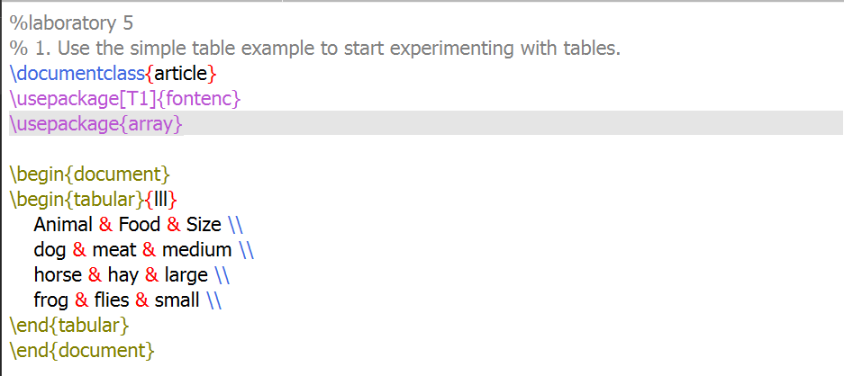
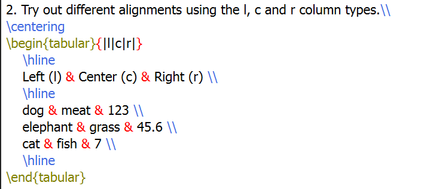
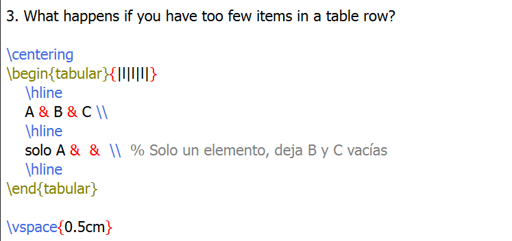
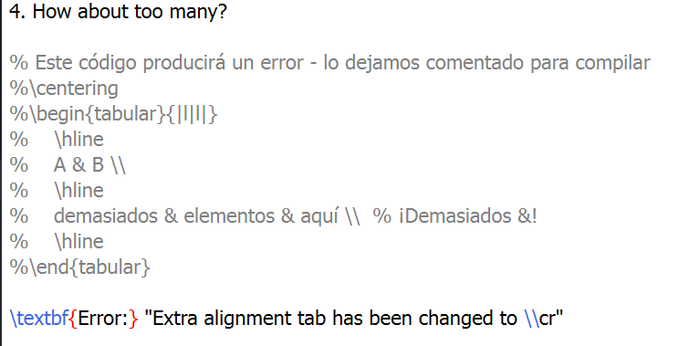
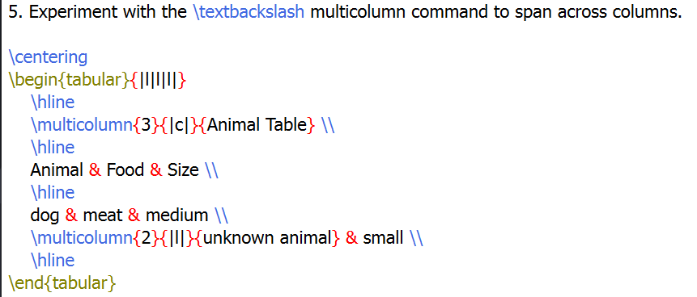

# Цель работы

Изучить структуру и правильный способ создания таблиц в LaTeX, освоить различные типы выравнивания, объединения ячеек и форматирования таблиц для научных работ.

# Выполнение лабораторной работы

## Базовая таблица с различными типами колонок

В качестве отправной точки была создана базовая таблица с тремя колонками, использующая различные типы выравнивания: левое (`l`), абзацное (`p`) и правое (`r`). Были опробованы вертикальные и горизонтальные линии для оформления границ таблицы
(см. рис. [-@fig:001], [-@fig:002]).

{#fig:001}

{#fig:002}

## Эксперименты с выравниванием колонок

Были опробованы различные комбинации типов выравнивания: левое (`l`), центральное (`c`) и правое (`r`). Эксперимент позволил наглядно сравнить поведение каждого типа при различных категориях данных — текстовых, числовых и смешанных
(см. рис. [-@fig:003], [-@fig:004]).

{#fig:003}

{#fig:004}

## Поведение таблицы при недостатке элементов в строке

Было изучено поведение компилятора при наличии строки с меньшим числом элементов, чем объявлено колонок. LaTeX не выдаёт ошибку, а оставляет соответствующие ячейки пустыми, сохраняя структуру таблицы
(см. рис. [-@fig:005], [-@fig:006]).

{#fig:005}

{#fig:006}

## Поведение таблицы при избытке элементов в строке

В отличие от предыдущего случая, при наличии большего числа элементов, чем объявлено колонок, LaTeX прерывает компиляцию с ошибкой `Extra alignment tab has been changed to \cr`. Это поведение было воспроизведено и задокументировано
(см. рис. [-@fig:007], [-@fig:008]).

{#fig:007}

{#fig:008}

## Объединение ячеек с командой \multicolumn

Была изучена команда `\multicolumn` для горизонтального объединения ячеек таблицы. Команда применялась для создания объединённых заголовков и специальных строк, охватывающих несколько колонок одновременно
(см. рис. [-@fig:009], [-@fig:010]).

{#fig:009}

{#fig:010}

# Выводы

В ходе выполнения лабораторной работы были приобретены необходимые знания и навыки для создания и форматирования таблиц в LaTeX. Были освоены различные типы выравнивания колонок (`l`, `c`, `r`, `p`), изучена команда `\multicolumn` для горизонтального объединения ячеек, а также выяснено поведение системы при структурных ошибках в таблице: при недостатке элементов LaTeX оставляет пустые ячейки, тогда как при избытке — прерывает компиляцию с ошибкой. Полученные навыки являются основой для создания профессионально оформленных таблиц в научных и технических документах.

# Список литературы{.unnumbered}

1. [Tables — Overleaf](https://www.overleaf.com/learn/latex/Tables)
2. [multicolumn command — LaTeX Wiki](https://en.wikibooks.org/wiki/LaTeX/Tables#Spanning)
3. [booktabs package documentation](https://ctan.org/pkg/booktabs)
