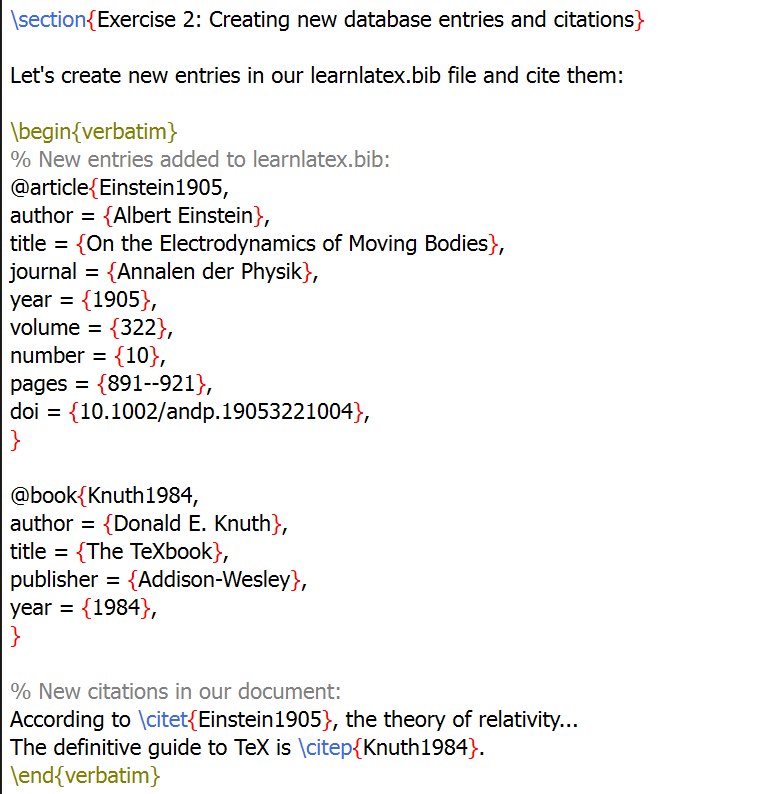
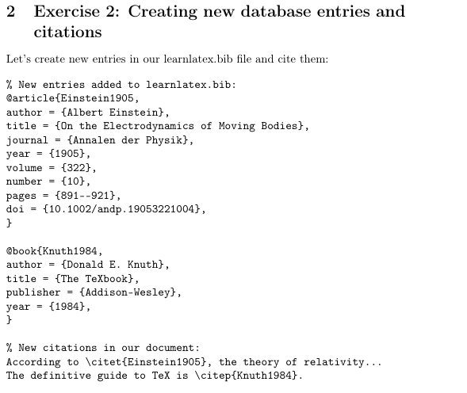
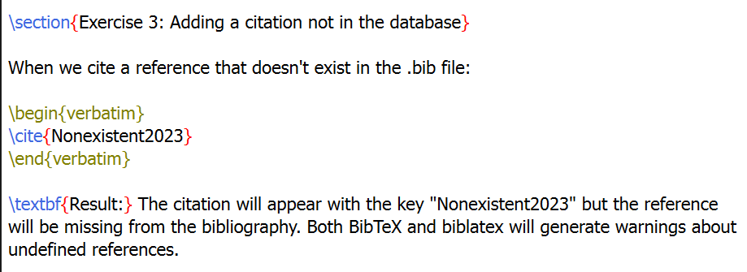
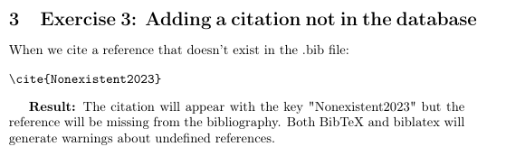
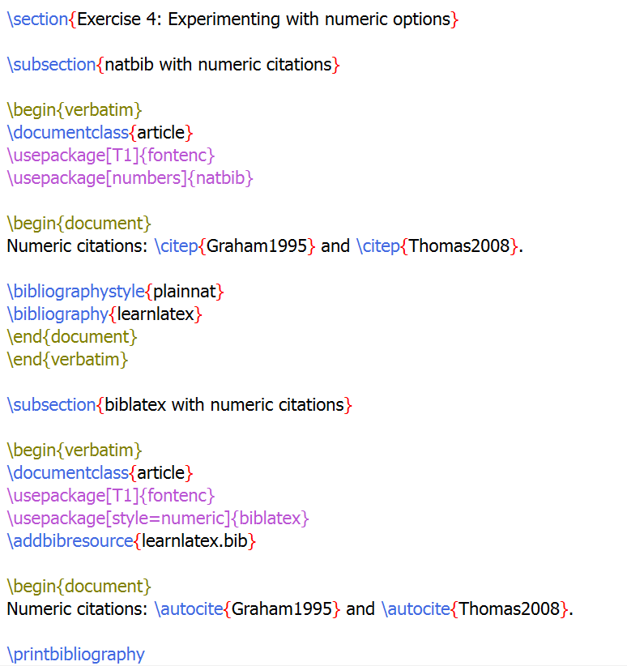
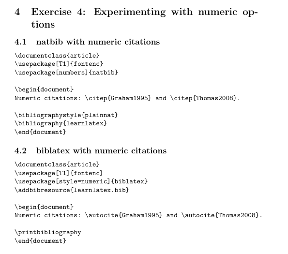

# Лабораторнаяработа No 6

**Computer Skills for Scientific Writing**

## Хосе Фернандо Леон Атупанья | НФИмд-01-24

## Содержание

- 1 Цель работы
- 2 Выполнение лабораторной работы
- 3 Выводы

## 1 Цель работы
Освоить работу с библиографией в LaTeX, изучить создание и использование BibTeX-файлов, научиться применять различные стили цитирования с помощью пакетов natbib и biblatex, а также понять различия между двумя подходами к управлению библиографией.

## 2 Выполнение лабораторной работы

1. Испытание примеров с natbib и biblatex

Задание: Протестировать оба примера (natbib и biblatex) с соответствующими процессами компиляции.
Для natbib требуется последовательность: LaTeX → BibTeX → LaTeX → LaTeX
Для biblatex требуется: LaTeX → Biber → LaTeX

Код для natbib с авторско-годовым стилем цитирования.

Результат - библиография в стиле plainnat с текстовыми и скобочными цитатами

2. Создание новых записей в базе данных и новых цитат.

Задание: Создать новые записи в BibTeX-файле и добавить соответствующие цитаты в документ.
Выполнение:
Добавлены две новые записи в файл learnlatex.bib: статья Эйнштейна 1905 года и книга Кнута 1984 года.

Новые записи в BibTeX-файле для статей Эйнштейна и Кнута

Использование новых цитат в документе LaTeX

3. Добавление цитаты, отсутствующей в базе данных

Задание: Добавить цитату на несуществующую в базе данных запись и наблюдать результат.
Выполнение:
При цитировании несуществующего источника система генерирует предупреждения, но компиляция завершается успешно.

Код с цитированием несуществующей записи Nonexistent2023

Предупреждения в логе компиляции об отсутствующих ссылках

4. Эксперименты с числовыми опциями в natbib и biblatex

Задание: Протестировать числовой стиль цитирования в обоих подходах.
Выполнение:
Для natbib используется опция numbers при загрузке пакета, для biblatex - style=numeric.

Код natbib с числовыми цитатами через опцию [numbers]

Результат - числовые цитаты в квадратных скобках

## 3 Выводы

В ходе данной лабораторной работы были успешно освоены ключевые аспекты работы с библиографией в LaTeX. Мы изучили два основных подхода к управлению цитированием: традиционный BibTeX с пакетом natbib и современный biblatex с Biber.
Были приобретены практические навыки создания и редактирования BibTeX-файлов, использования различных стилей цитирования (автор-год и числовой), а также понимания процессов компиляции для каждого метода. Особое внимание было уделено различиям в синтаксисе команд между двумя подходами и особенностям обработки ошибок при ссылках на отсутствующие источники.
Полученные знания позволяют эффективно управлять библиографическими ссылками в научных работах, выбирая оптимальный подход в зависимости от требований издания или личных предпочтений.
