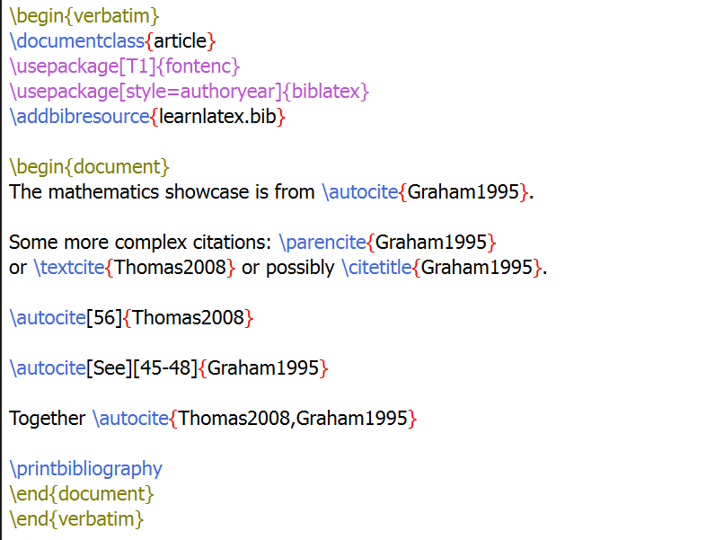
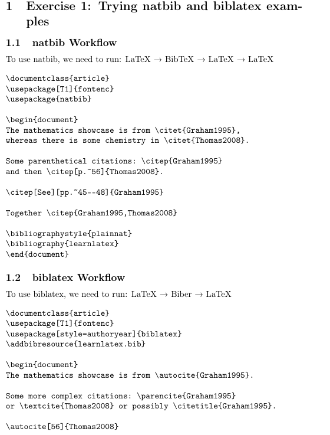
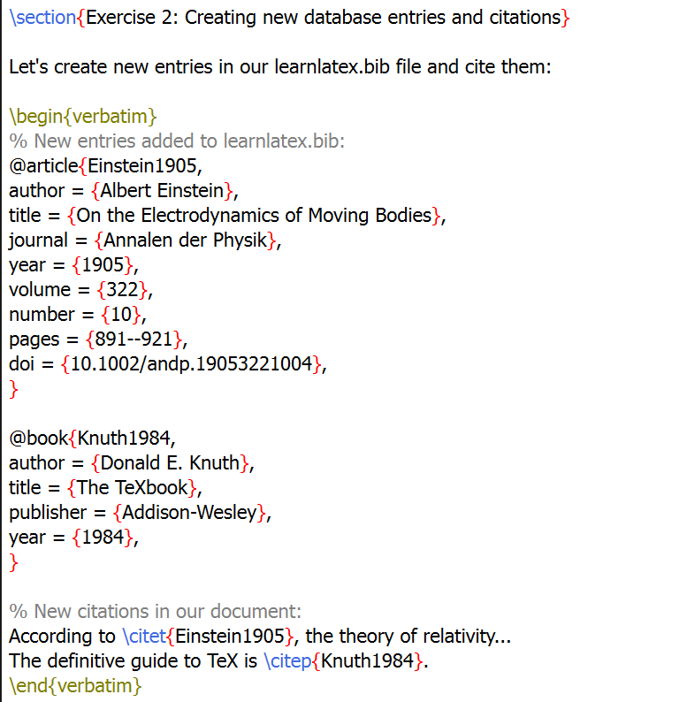
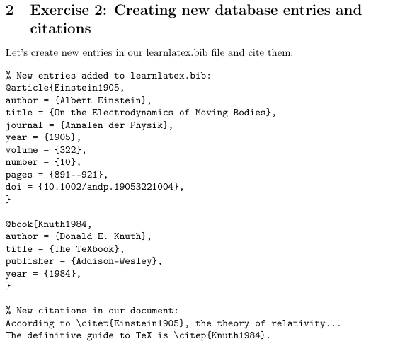
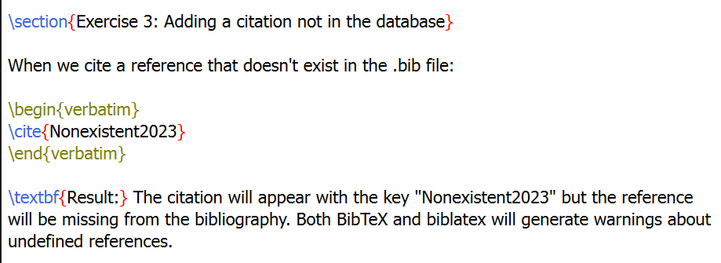
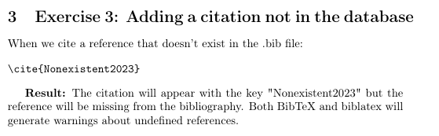
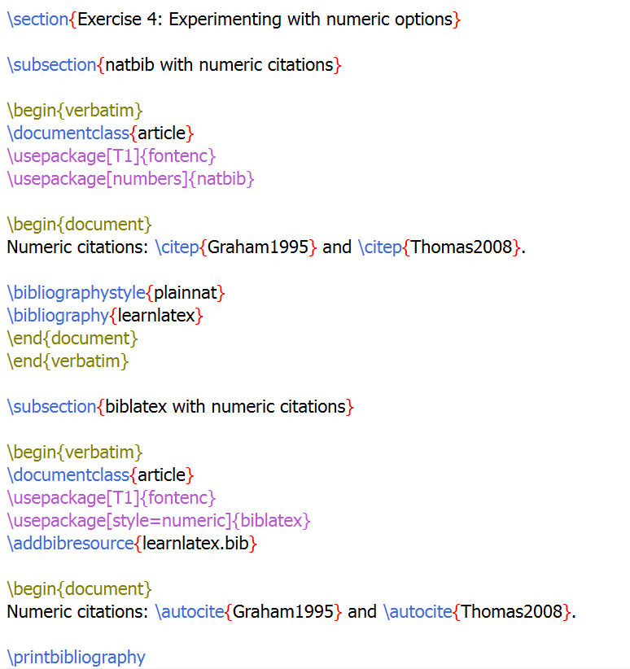
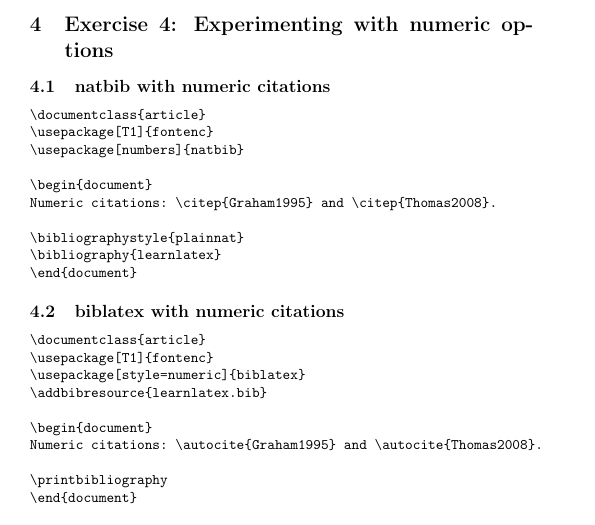

# Цель работы

Освоить работу с библиографией в LaTeX, изучить создание и использование BibTeX-файлов, научиться применять различные стили цитирования с помощью пакетов `natbib` и `biblatex`, а также понять различия между двумя подходами к управлению библиографией.

# Выполнение лабораторной работы

## Тестирование natbib и biblatex

Были протестированы оба подхода к управлению библиографией с соответствующими процессами компиляции. Для `natbib` требуется последовательность LaTeX → BibTeX → LaTeX → LaTeX, тогда как для `biblatex` используется цепочка LaTeX → Biber → LaTeX. Был опробован авторско-годовой стиль цитирования со стилем оформления `plainnat`, включающий как текстовые, так и скобочные цитаты
(см. рис. [-@fig:001], [-@fig:002]).

{#fig:001}

{#fig:002}

## Создание новых записей в BibTeX-файле

В файл `learnlatex.bib` были добавлены две новые записи: статья Эйнштейна 1905 года и книга Кнута 1984 года. Для каждой записи были указаны обязательные поля в соответствии с типом источника (`@article` и `@book`), после чего соответствующие цитаты были добавлены в текст документа
(см. рис. [-@fig:003], [-@fig:004]).

{#fig:003}

{#fig:004}

## Цитирование отсутствующей записи

Было изучено поведение системы при ссылке на несуществующий в базе данных источник. При цитировании записи `Nonexistent2023` компиляция завершается успешно, однако в лог-файле генерируются предупреждения об отсутствующих ссылках, а в тексте документа на месте цитаты отображается жирный вопросительный знак
(см. рис. [-@fig:005], [-@fig:006]).

{#fig:005}

{#fig:006}

## Числовой стиль цитирования в natbib и biblatex

Был протестирован числовой стиль цитирования в обоих подходах. Для `natbib` используется опция `numbers` при загрузке пакета, для `biblatex` — параметр `style=numeric`. В обоих случаях цитаты отображаются в виде чисел в квадратных скобках, однако синтаксис команд и процесс компиляции различаются
(см. рис. [-@fig:007], [-@fig:008]).

{#fig:007}

{#fig:008}

# Выводы

В ходе выполнения лабораторной работы были освоены ключевые аспекты работы с библиографией в LaTeX. Были изучены два основных подхода к управлению цитированием: традиционный BibTeX с пакетом `natbib` и современный `biblatex` с Biber. Получены практические навыки создания и редактирования BibTeX-файлов, применения авторско-годового и числового стилей цитирования, а также понимания цепочек компиляции для каждого метода. Отдельное внимание было уделено поведению системы при ссылках на отсутствующие источники. Полученные знания позволяют эффективно управлять библиографическими ссылками в научных работах, выбирая оптимальный подход в зависимости от требований издания.

# Список литературы{.unnumbered}

1. [Bibliography management in LaTeX — Overleaf](https://www.overleaf.com/learn/latex/Bibliography_management_in_LaTeX)
2. [natbib package documentation](https://ctan.org/pkg/natbib)
3. [biblatex package documentation](https://ctan.org/pkg/biblatex)
4. [Biber — backend for biblatex](https://ctan.org/pkg/biber)
