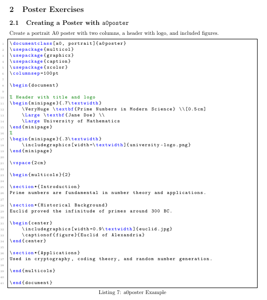
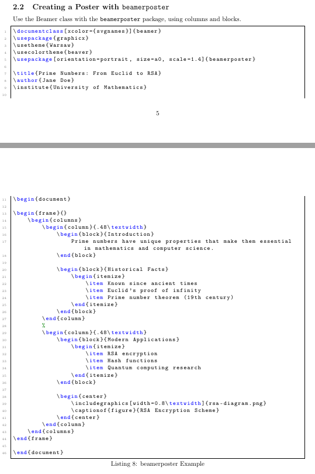
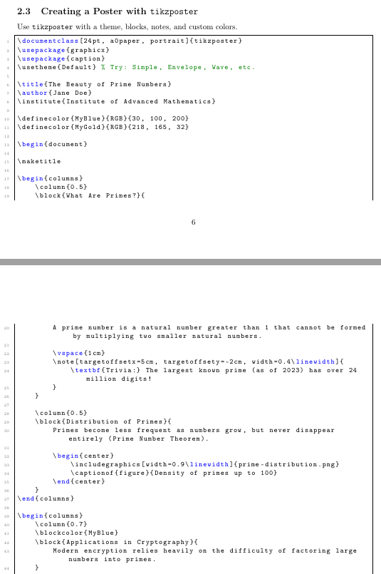
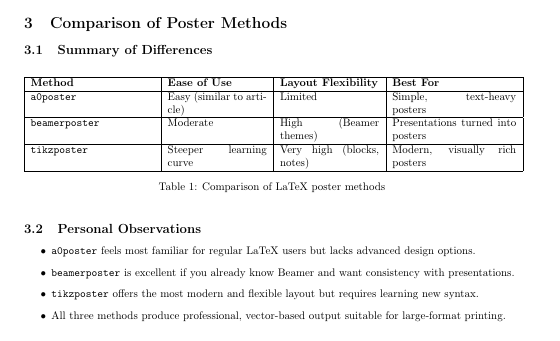

# Лабораторнаяработа No 7

**Computer Skills for Scientific Writing**

## Хосе Фернандо Леон Атупанья | НФИмд-01-24

## Содержание

- 1 Цель работы
- 2 Выполнение лабораторной работы
- 3 Выводы

## 1 Цель работы
Освоить создание презентаций и научных постеров в LaTeX с использованием класса Beamer и специализированных пакетов для постеров (a0poster, beamerposter, tikzposter). Изучить структуру презентаций, управление появлением контента (pause, uncover), работу с темами и цветами, а также научиться создавать многостолбцовые макеты и блоки для постеров.

## 2 Выполнение лабораторной работы

1.  Создание презентации в Beamer

Задание: Создать базовую презентацию с использованием темы Copenhagen, включая заголовочный слайд и три содержательных слайда.

Выполнение:
Был создан документ Beamer с заголовком, автором и датой. Использована тема Copenhagen. Добавлены слайды с использованием окружения frame. Результат — чистая, структурированная презентация с заголовком и тремя слайдами.

Код для natbib с авторско-годовым стилем цитирования.

Результат - библиография в стиле plainnat с текстовыми и скобочными цитатами

2.  Использование блоков и списков

Задание: Применить окружения block, enumerate и itemize для организации информации.

Выполнение:
На слайд добавлены блоки с определением и теоремой, а также нумерованный список. Это позволяет визуально отделять разные типы информации.

Новые записи в BibTeX-файле для статей Эйнштейна и Кнута

Использование новых цитат в документе LaTeX

3. Управление появлением контента (pause и uncover)

Задание: Реализовать пошаговое появление элементов на слайде.

Выполнение:
Использованы команды \pause и \uncover. С помощью \pause элементы появляются последовательно. С помощью \uncover<2-> можно контролировать, на каком шаге появляется каждый элемент

Код с цитированием несуществующей записи Nonexistent2023
Предупреждения в логе компиляции об отсутствующих ссылках

4. Смена темы и цветов

Задание: Изменить тему на Warsaw и цветовую схему на beaver.

Выполнение:
В преамбулу добавлены команды:

\usetheme{Warsaw}
\usecolortheme{beaver}

Это меняет внешний вид презентации на более контрастный и стильный.

## 3 Выводы

В ходе выполнения лабораторной работы были освоены ключевые навыки создания презентаций и научных постеров в LaTeX. Были изучены:
Beamer — для создания структурированных презентаций с поддержкой тем, анимации и пошагового отображения контента.
Три метода создания постеров:

- a0poster — простой, похож на обычный документ LaTeX.

- beamerposter — использует знакомый синтаксис Beamer, подходит для пользователей Beamer.

- tikzposter — предлагает наибольшую гибкость и современный дизайн, но требует больше времени на освоение.

Были получены практические навыки работы с колонками, блоками, изображениями, пользовательскими цветами и заметками. Каждый метод имеет свои преимущества, и выбор зависит от задачи, уровня подготовки и требований к визуальному оформлению.

LaTeX предоставляет профессиональные инструменты для создания качественных научных материалов, готовых к печати и презентации на конференциях.
