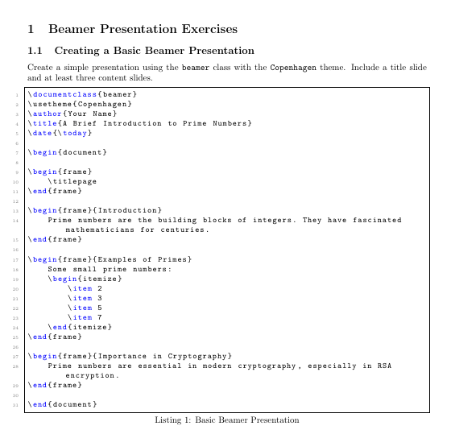
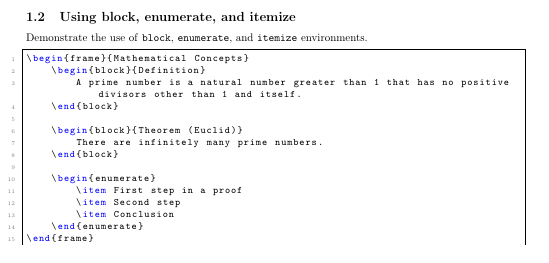
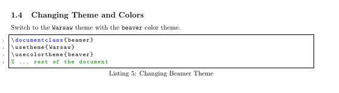
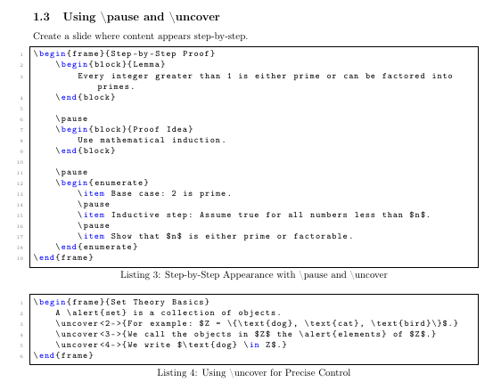
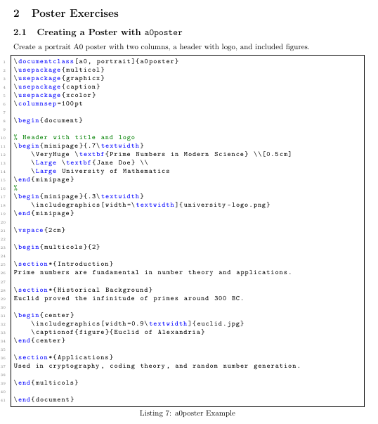
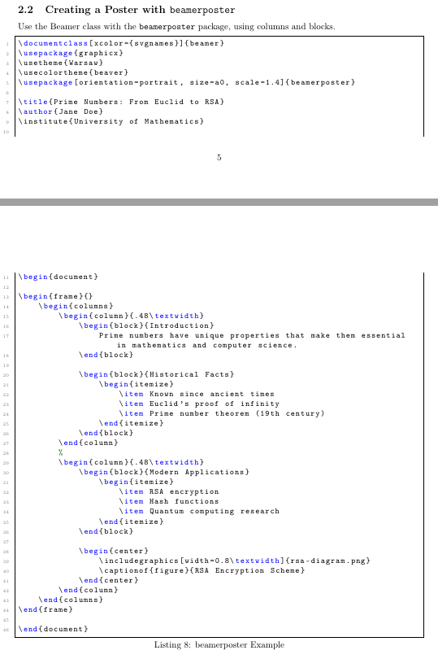
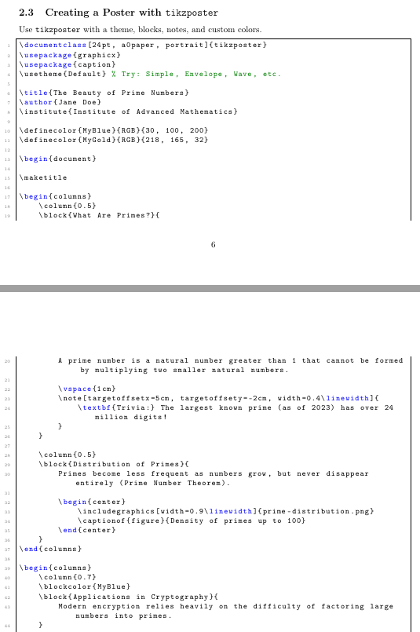
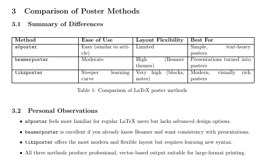

# Цель работы

Освоить создание презентаций и научных постеров в LaTeX с использованием класса Beamer и специализированных пакетов для постеров (`a0poster`, `beamerposter`, `tikzposter`). Изучить структуру презентаций, управление появлением контента (`\pause`, `\uncover`), работу с темами и цветами, а также научиться создавать многостолбцовые макеты и блоки для постеров.

# Выполнение лабораторной работы

## Создание презентации в Beamer

Был создан документ Beamer с заголовком, автором и датой с использованием темы Copenhagen. Слайды оформлены с помощью окружения `frame`. Результатом стала структурированная презентация с заголовочным слайдом и тремя содержательными слайдами
(см. рис. [-@fig:001], [-@fig:002], [-@fig:003], [-@fig:004]).

{#fig:001}

{#fig:002}

{#fig:003}

{#fig:004}

## Использование блоков и списков

На слайды были добавлены окружения `block` с определением и теоремой, а также нумерованный список через `enumerate`. Применение блоков позволяет визуально разграничивать различные типы информации и придаёт слайдам академическую структуру
(см. рис. [-@fig:005], [-@fig:006], [-@fig:007]).

{#fig:005}

{#fig:006}

{#fig:007}

## Управление появлением контента

Были изучены команды пошагового появления элементов на слайде. Команда `\pause` обеспечивает последовательное отображение элементов, тогда как `\uncover<2->` позволяет точно задать номер шага, на котором должен появиться каждый конкретный элемент
(см. рис. [-@fig:008]).

{#fig:008}

## Смена темы и цветовой схемы

В преамбулу документа были добавлены команды смены темы и цветов:
```latex
\usetheme{Warsaw}
\usecolortheme{beaver}
```

Тема Warsaw в сочетании с цветовой схемой beaver придаёт презентации более контрастный и выразительный внешний вид по сравнению с Copenhagen
(см. рис. [-@fig:009]).

{#fig:009}

# Выводы

В ходе выполнения лабораторной работы были освоены ключевые навыки создания презентаций и научных постеров в LaTeX. Был изучен класс Beamer для создания структурированных презентаций с поддержкой тем, анимации и пошагового отображения контента. Были рассмотрены три подхода к созданию постеров: `a0poster` — простой, схожий с обычным документом LaTeX; `beamerposter` — использующий знакомый синтаксис Beamer; `tikzposter` — предлагающий наибольшую гибкость и современный дизайн. Получены практические навыки работы с колонками, блоками, пользовательскими цветами и заметками. Выбор метода определяется задачей, уровнем подготовки и требованиями к визуальному оформлению.

LaTeX предоставляет профессиональные инструменты для создания качественных научных материалов, готовых к печати и презентации на конференциях.

# Список литературы{.unnumbered}

1. [Beamer — Overleaf](https://www.overleaf.com/learn/latex/Beamer)
2. [Beamer package documentation — CTAN](https://ctan.org/pkg/beamer)
3. [tikzposter package documentation — CTAN](https://ctan.org/pkg/tikzposter)
4. [beamerposter package documentation — CTAN](https://ctan.org/pkg/beamerposter)
