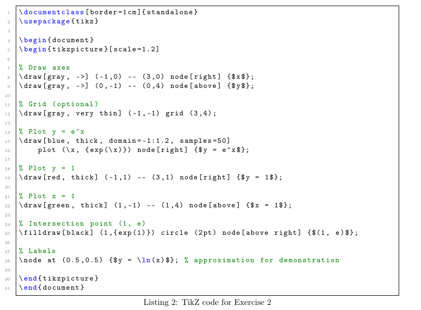
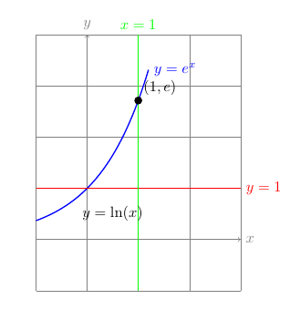
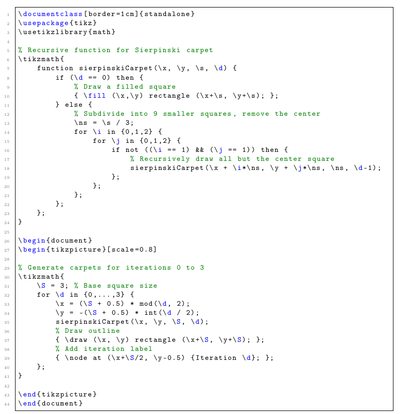
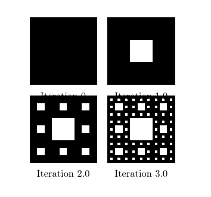

# Лабораторнаяработа No 8

**Computer Skills for Scientific Writing**

## Хосе Фернандо Леон Атупанья | НФИмд-01-24

## Содержание

- 1 Цель работы
- 2 Выполнение лабораторной работы
- 3 Выводы

## 1 Цель работы
Освоить создание диаграмм и графических объектов в LaTeX с использованием пакета TikZ. Изучить основные принципы программирования графики: создание линий, кривых, узлов (нод), построение графиков функций и использование циклов для генерации сложных итеративных фигур. Научиться описывать графические объекты с помощью кода вместо ручного рисования.

## 2 Выполнение лабораторной работы

1.  Создание графа

Задание: Воспроизвести граф, состоящий из шести узлов, расположенных по кругу, с направленными ребрами и двумя перекрестными связями.

Выполнение:
Был создан код TikZ, использующий полярные координаты для расположения узлов по кругу. Каждый узел представлен как окружность с меткой (A–F). Ребра нарисованы с помощью команды \draw[->] и подписаны цифрами 1–6. Две перекрестные связи созданы с помощью изогнутых путей (to[out=..., in=...]). Весь граф масштабирован для лучшей видимости.

Код:

2.   Построение графиков функций
Задание: Построить графики функций 
y
=
e
x
y=e 
x
 , 
y
=
1
y=1, 
x
=
1
x=1 и подписать оси координат.

Выполнение:
Созданы оси координат с подписями x и y. Добавлена сетка для удобства чтения. График   построен с помощью команды plot с функцией exp(\x). Горизонтальная линия y=1 и вертикальная линия x=1 нарисованы как обычные отрезки. Точка пересечения (1,e) отмечена закрашенным кружком. Для полноты картины добавлена метка y=ln(x).

3. Ковёр Серпинского

Задание: Адаптировать предоставленный код для треугольника Серпинского, чтобы сгенерировать несколько итераций ковра Серпинского.

Выполнение:
Определена рекурсивная функция sierpinskiCarpet, которая делит квадрат на 9 меньших квадратов и удаляет центральный. Функция вызывает себя рекурсивно для каждого из оставшихся 8 квадратов, пока не достигнет глубины 0. Сгенерированы итерации 0–3, расположенные в сетке 2×2. Каждый ковёр обведён рамкой и подписан номером итерации.

## 3 Выводы

В ходе выполнения лабораторной работы были освоены ключевые навыки создания векторной графики в LaTeX с помощью пакета TikZ. Были изучены:

Основные элементы TikZ:

Создание путей (линий, кривых) с помощью команд \draw, --, to, .. controls ...

Работа с узлами (node) для размещения текста и математических формул.

Использование различных стилей линий (цвет, толщина, пунктир, стрелки).

Системы координат:

Декартовы координаты (x,y).

Полярные координаты (угол:радиус).

Масштабирование и трансформации.

Построение графиков функций:

Использование команды plot для визуализации математических функций.

Добавление осей координат, сетки и подписей.

Программирование в TikZ:

Использование циклов \foreach для создания повторяющихся элементов.

Определение рекурсивных функций с помощью \tikzmath для генерации фрактальных структур (ковёр Серпинского).
TikZ предоставляет мощный и гибкий инструмент для создания профессиональных диаграмм, графиков и иллюстраций непосредственно в LaTeX-документах. Основное преимущество — полная интеграция с LaTeX, что обеспечивает согласованность шрифтов, математической нотации и стиля с основным текстом работы. Несмотря на начальную сложность (необходимость программировать графику), TikZ позволяет достичь высокой точности и воспроизводимости результатов, что особенно важно в научных публикациях.