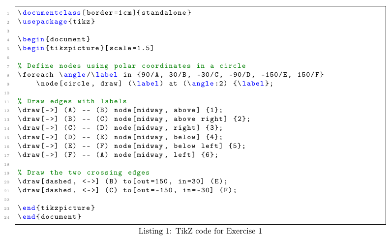
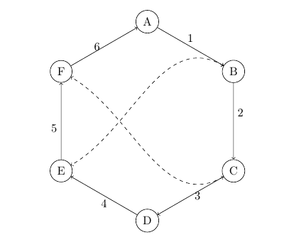
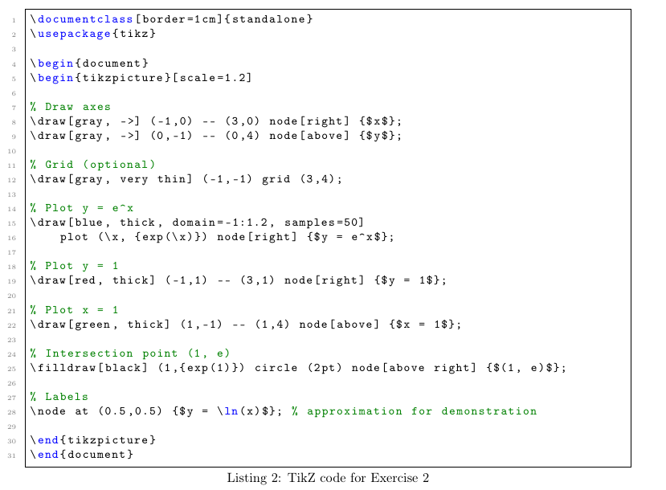
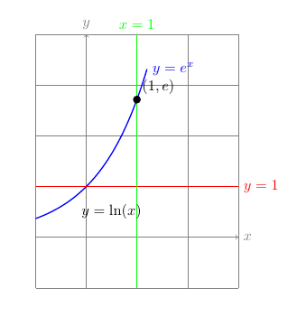
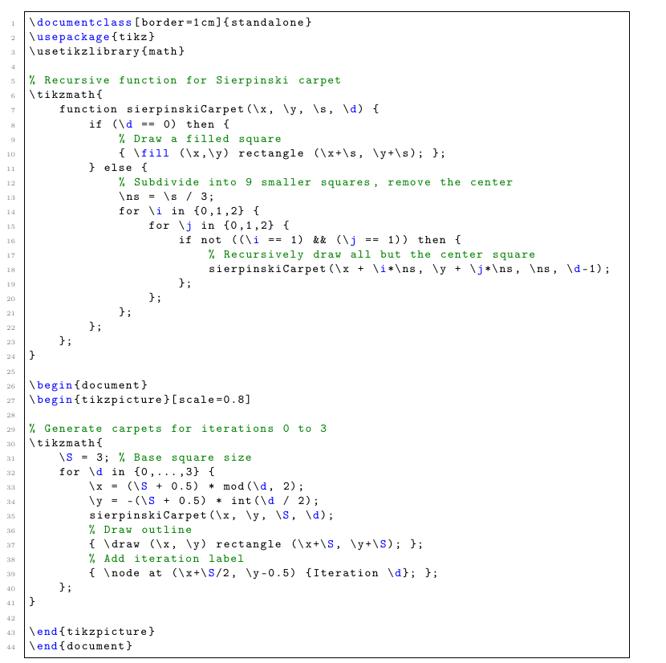
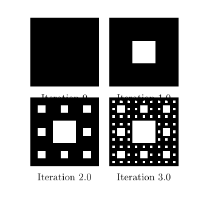

# Цель работы

Освоить создание диаграмм и графических объектов в LaTeX с использованием пакета TikZ. Изучить основные принципы программирования графики: создание линий, кривых, узлов, построение графиков функций и использование циклов для генерации сложных итеративных фигур. Научиться описывать графические объекты с помощью кода вместо ручного рисования.

# Выполнение лабораторной работы

## Создание графа

Был воспроизведён граф, состоящий из шести узлов, расположенных по кругу, с направленными рёбрами и двумя перекрёстными связями. Для размещения узлов использовались полярные координаты, каждый узел представлен окружностью с меткой (A–F). Рёбра нарисованы командой `\draw[->]` и подписаны цифрами 1–6, а две перекрёстные связи реализованы с помощью изогнутых путей через параметры `to[out=..., in=...]`
(см. рис. [-@fig:001], [-@fig:002]).

{#fig:001}

{#fig:002}

## Построение графиков функций

Были построены графики функций \( y = e^x \), \( y = 1 \) и \( x = 1 \) с подписанными осями координат. Для визуализации функции использовалась команда `plot` с выражением `exp(\x)`. Горизонтальная и вертикальная линии нарисованы как обычные отрезки, точка пересечения \((1, e)\) отмечена закрашенным кружком, а для полноты картины добавлена метка \( y = \ln(x) \). Была также добавлена сетка для удобства чтения графика
(см. рис. [-@fig:003], [-@fig:004]).

{#fig:003}

{#fig:004}

## Ковёр Серпинского

Код для треугольника Серпинского был адаптирован для генерации ковра Серпинского. Была определена рекурсивная функция `sierpinskiCarpet`, которая делит квадрат на 9 меньших квадратов и удаляет центральный, вызывая себя рекурсивно для каждого из оставшихся 8 до достижения глубины 0. Были сгенерированы итерации 0–3, расположенные в сетке 2×2, каждая обведена рамкой и подписана номером итерации
(см. рис. [-@fig:005], [-@fig:006]).

{#fig:005}

{#fig:006}

# Выводы

В ходе выполнения лабораторной работы были освоены ключевые навыки создания векторной графики в LaTeX с помощью пакета TikZ. Были изучены основные элементы: создание путей с помощью команд `\draw`, `--`, `to` и `.. controls ...`, работа с узлами (`node`) для размещения текста и формул, использование декартовых и полярных систем координат, а также различных стилей линий. Получены навыки построения графиков функций командой `plot` с добавлением осей, сетки и подписей. Отдельное внимание было уделено программированию в TikZ: использованию циклов `\foreach` и определению рекурсивных функций через `\tikzmath` для генерации фрактальных структур.

TikZ предоставляет мощный и гибкий инструмент для создания профессиональных диаграмм и иллюстраций непосредственно в LaTeX-документах. Его главное преимущество — полная интеграция с LaTeX, обеспечивающая согласованность шрифтов, математической нотации и стиля с основным текстом. Несмотря на начальную сложность, TikZ позволяет достичь высокой точности и воспроизводимости результатов, что особенно важно в научных публикациях.

# Список литературы{.unnumbered}

1. [TikZ and PGF — Overleaf](https://www.overleaf.com/learn/latex/TikZ_package)
2. [TikZ package documentation — CTAN](https://ctan.org/pkg/pgf)
3. [TikZ examples — TeXample.net](https://texample.net/tikz/examples/)
